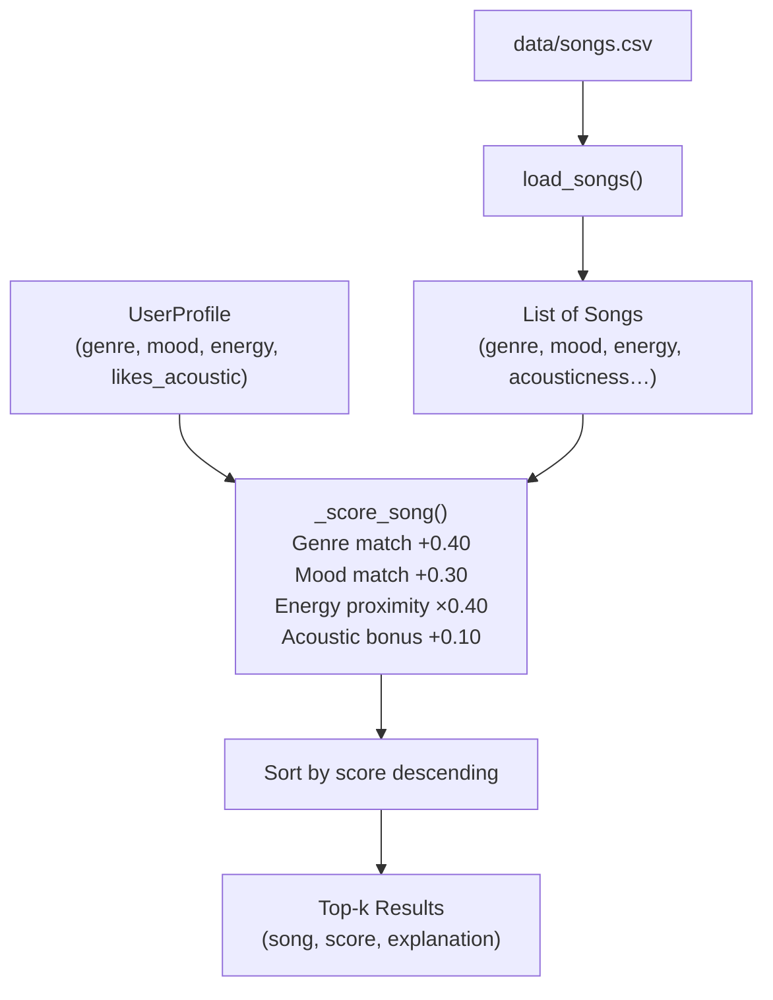
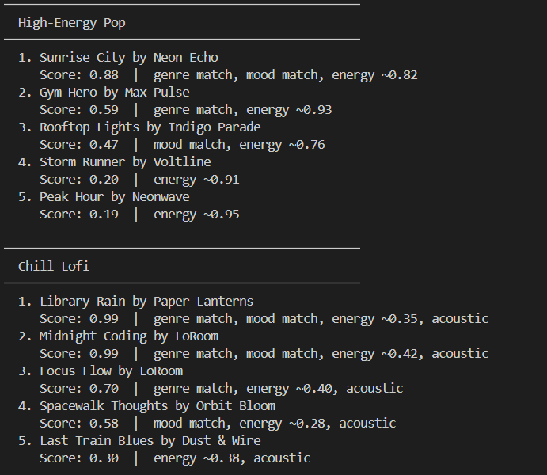
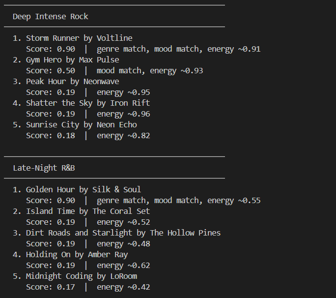
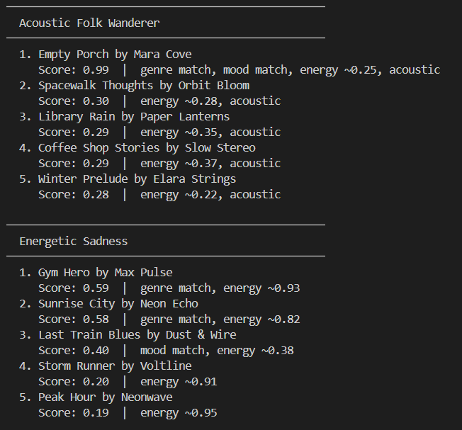
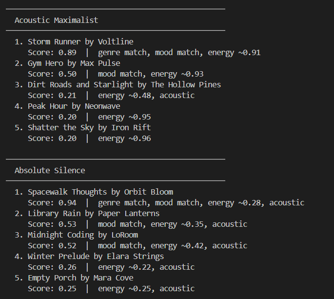
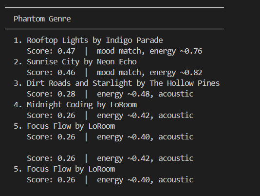
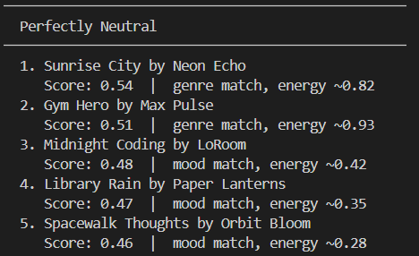

# Music Recommender Simulation

## Project Summary

This project is a small music recommender system that suggests songs from a catalog based on a user's taste profile. It models how real-world recommender systems (like Spotify or YouTube Music) turn structured data about songs and listeners into ranked suggestions.

The system represents songs as data objects with audio features (genre, mood, energy, tempo, valence, danceability, acousticness, speechiness, instrumentalness), stores a user's preferences in a profile, and applies a scoring function to rank the catalog for that user. The catalog contains 20 songs spanning 10 genres and 10 moods.

---

## How The System Works

### Song Features

Each `Song` in the catalog ([src/recommender.py](src/recommender.py)) stores:

| Feature | Type | Description |
|---|---|---|
| `genre` | string | Musical genre (e.g., pop, lofi, rock, jazz) |
| `mood` | string | Emotional tone (e.g., happy, chill, intense, moody) |
| `energy` | float (0–1) | How energetic or driving the track feels |
| `tempo_bpm` | float | Beats per minute |
| `valence` | float (0–1) | Musical positivity (high = upbeat, low = somber) |
| `danceability` | float (0–1) | How suitable the track is for dancing |
| `acousticness` | float (0–1) | How acoustic (vs. electronic) the track sounds |
| `speechiness` | float (0–1) | Presence of spoken words (high in rap/hip-hop, low in instrumentals) |
| `instrumentalness` | float (0–1) | Likelihood the track has no vocals (near 1.0 = purely instrumental) |

### User Profile

A `UserProfile` captures four preference signals:

- `favorite_genre` — the genre the user most wants to hear
- `favorite_mood` — the mood the user is in
- `target_energy` — their preferred energy level (0–1)
- `likes_acoustic` — whether they lean toward acoustic or electronic tracks

### Scoring Logic

The `Recommender` class and `recommend_songs` function score each song against the user profile. A song earns points for:

1. **Genre match** — does the song's genre match `favorite_genre`
2. **Mood match** — does the song's mood match `favorite_mood`
3. **Energy proximity** — how close `song.energy` is to `target_energy`
4. **Acoustic preference** — bonus if `likes_acoustic` aligns with a high `acousticness` value

The top `k` songs (default 5) with the highest scores are returned as recommendations, each with a short explanation of why it was chosen.

### Recommendation Flow



---

## Getting Started

### Setup

1. Create a virtual environment (optional but recommended):

   ```bash
   python -m venv .venv
   source .venv/bin/activate      # Mac or Linux
   .venv\Scripts\activate         # Windows
   ```

2. Install dependencies:

   ```bash
   pip install -r requirements.txt
   ```

3. Run the app:

   ```bash
   python -m src.main
   ```

### Running Tests

```bash
pytest
```

You can add more tests in `tests/test_recommender.py`.

---







---

## Experiments

**Weight tuning — genre vs. energy**
Genre started at 0.40, energy at 0.20. A pop user wanting chill mood still got two wrong-mood pop songs at the top. Halving genre to 0.20 and doubling energy to 0.40 fixed it.

**Adversarial profiles**
Phantom Genre (`bossa_nova`) matched nothing on genre — the list still ranked meaningfully by mood and energy. Absolute Silence (`energy: 0.0`) exposed the catalog floor penalty at 0.22.

**Acoustic preference**
`likes_acoustic: True` consistently surfaced quieter songs. `likes_acoustic: False` still received acoustic songs — there is no penalty, only a one-directional bonus.

---

## Limitations

- **Small catalog** — most genres have one match and four fallbacks.
- **Exact string matching** — "indie pop" ≠ "pop", "chill" ≠ "relaxed". Adjacent labels score zero overlap.
- **No penalty system** — wrong-mood songs still appear via energy-proximity credit.
- **Static preferences** — the system cannot learn or adjust over time.
- **Catalog energy floor** — quietest song is 0.22; low-energy users are always slightly penalized.

---

## Reflection

Changing two weight values — no logic, no new features — completely changed whose preferences the system respected. Scoring weights are not neutral. They encode priorities that users never see.

The Perfectly Neutral profile was the most surprising result. A user asking for chill pop got wrong-mood songs at the top simply because genre matched. A small catalog amplifies bias in ways that are invisible until you deliberately test for them.

See [model_card.md](model_card.md) and [reflection.md](reflection.md) for the full evaluation and profile comparisons.

---

## Model Card

See [model_card.md](model_card.md) for a full evaluation of the system's intended use, strengths, limitations, and ethical considerations.
